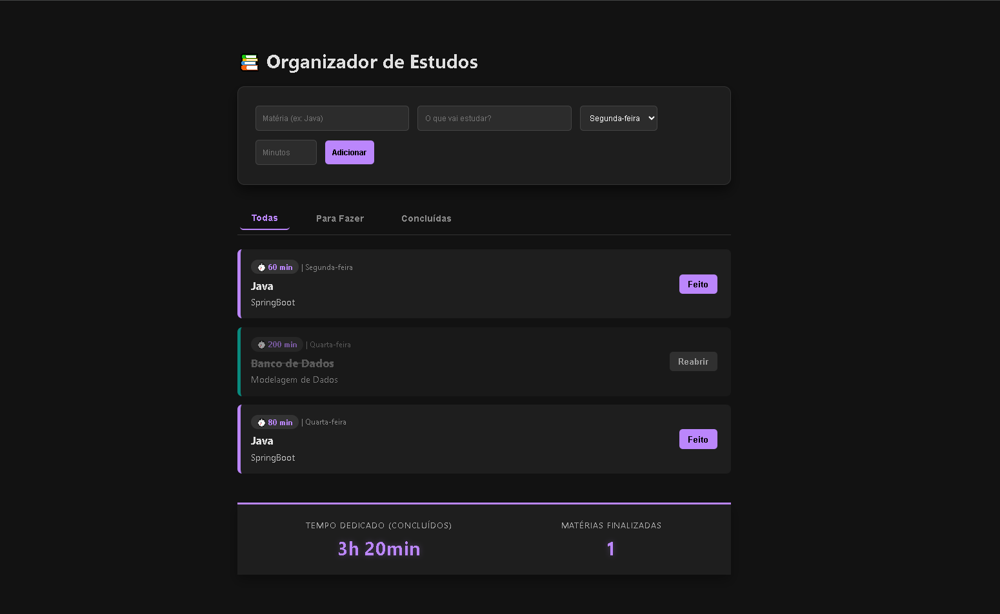

---

# 📚 Organizador de Estudos

Aplicação web desenvolvida com **Java + Spring Boot** para organização e acompanhamento de estudos.

---

## 🛠 Tecnologias

* Java 17
* Spring Boot
* Spring Data JPA
* H2 Database
* Maven
* HTML + CSS + JavaScript

---

## 📷 Interface



---

## ✨ Funcionalidades

* Cadastro de tarefas de estudo
* Definição de matéria e conteúdo
* Controle de tempo em minutos
* Marcar como concluída / reabrir
* Dashboard com tempo total dedicado
* Persistência em banco de dados

---

## 🗄 Banco de Dados

H2 Database (modo arquivo)

Console disponível em:

```
http://localhost:8080/h2-console
```

---

## ▶ Como executar

```bash
git clone https://github.com/DaviSanttana/OrganizacaoEstudos
cd OrganizacaoEstudos
mvn spring-boot:run
```

---

## 🎯 Objetivo

Projeto criado para praticar:

* Arquitetura em camadas
* Persistência com JPA
* Integração backend + frontend
* Organização de projeto Spring Boot

---

## 👨‍💻 Autor

Davi Santtana
[GitHub](https://github.com/DaviSanttana)

---

